 

  

&nbsp;

&nbsp;

  

---

# ⚡ Building AI Systems That Automate Real Business Workflows

 

## 👨‍💻 About Me

I'm an **AI Automation Engineer** focused on designing and building intelligent systems that connect AI with real business operations.

I work across:

**AI Agents · n8n · RAG · Voice AI · CRM Automation · APIs · Webhooks**

I enjoy turning repetitive manual processes into **intelligent, reliable and scalable automation systems.**

---

## 🧩 What I Build

<table>
<tr>
<td align="center" width="50%">

### 🤖 AI AGENTS

Intelligent assistants that understand context, use tools and execute business tasks.

</td>

<td align="center" width="50%">

### ⚡ AUTOMATION

Business workflows powered by n8n, APIs, webhooks and CRM systems.

</td>
</tr>

<tr>
<td align="center">

### 🧠 RAG SYSTEMS

Knowledge-based AI using retrieval, embeddings and vector databases.

</td>

<td align="center">

### 📞 VOICE AI

Conversational agents for qualification, support and appointment workflows.

</td>
</tr>

<tr>
<td align="center">

### 🔗 CRM AUTOMATION

Lead management, follow-ups, pipelines and customer workflows.

</td>

<td align="center">

### 🔌 API INTEGRATIONS

Connecting AI systems with business platforms and external services.

</td>
</tr>
</table>

---

## 🛠️ Tech Stack

### 🧠 AI / Development

  

  

### ⚙️ Automation

  

### 📞 Voice AI

  

### 🗄️ Data / Backend

  

---

## 🚀 Featured Systems

### 📧 AI EMAIL AUTOMATION

AI-powered lead follow-up system that understands conversations and generates contextual responses.

**n8n · AI Agents · Email Automation · CRM**

 

### 🧠 RAG KNOWLEDGE ASSISTANT

Retrieval-augmented AI system that searches a knowledge base and produces context-aware responses.

**RAG · Pinecone · Supabase · LLMs**

 

### 📞 AI VOICE ASSISTANT

Conversational voice system for customer interaction, qualification and appointment workflows.

**VAPI · Twilio · AI Agents**

 

### 🔗 CRM AUTOMATION

Automated CRM workflows connecting leads, conversations, pipelines and external services.

**GoHighLevel · n8n · APIs · Webhooks**

---

## 📊 GitHub Performance

  

---

## 🟩 Contribution Activity

---

## 🐍 Contribution Snake

<picture>
  <source media="(prefers-color-scheme: dark)" srcset="./output/github-snake-dark.svg">
  <source media="(prefers-color-scheme: light)" srcset="./output/github-snake.svg">
  
</picture>

---

## 🎯 Current Focus

| | |
|---|---|
| 🤖 AI Engineering | 🧠 AI Agents |
| 🔎 RAG & Vector Search | ⚡ n8n Automation |
| 📞 Voice AI | 🔗 CRM Automation |
| 🔌 API Architecture | 🚀 Production AI Systems |

---

## 🌐 Let's Connect

 

  

**Building intelligent systems that automate real business workflows.**

